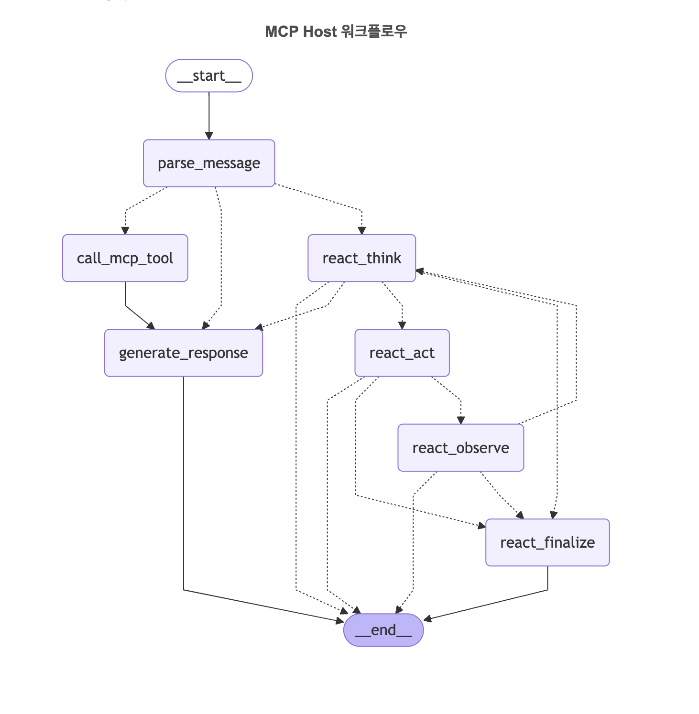

# MCP 호스트 - AI 대화 시스템

> LangGraph와 Model Context Protocol을 활용한 지능형 AI 대화 시스템

## 📚 프로젝트 개요

**이 프로젝트는 Model Context Protocol(MCP)의 작동 방식을 이해하기 위한 교육용 데모 시스템입니다.**


#### 📹 기본 사용법 데모
[](https://youtu.be/mt0o0Dx6jOU)

*기본적인 웹 UI 사용법과 AI와의 대화 과정을 보여주는 데모 영상입니다.*

#### 📹 ReAct 모드 날씨 검색 데모
[](https://youtu.be/yQQ5yKAIMTg)

*ReAct 패턴을 통한 복합적인 날씨 검색 및 리포트 생성 과정을 보여주는 데모 영상입니다. Think → Act → Observe 사이클을 통해 단계별로 정보를 수집하고 분석합니다.*

#### 📹 Phoenix 모니터링 데모
[](https://youtu.be/YWJDD2ldvsw)

*Phoenix UI를 통한 AI 애플리케이션 추적 및 성능 분석 과정을 보여주는 데모 영상입니다.*


MCP는 AI 애플리케이션이 다양한 데이터 소스와 도구에 안전하고 표준화된 방식으로 연결할 수 있게 해주는 개방형 프로토콜입니다. 본 데모를 통해 다음을 학습할 수 있습니다:

### 🎯 학습 목표
- **MCP 프로토콜 이해**: 클라이언트-서버 아키텍처와 JSON-RPC 통신 방식
- **실제 구현 체험**: LangChain MCP Adapters를 활용한 실제 MCP 클라이언트 구현
- **다양한 MCP 서버 연동**: 더미 서버(교육용)와 실제 서버(Context7) 비교 체험
- **LangGraph 워크플로우**: MCP 도구를 활용한 복잡한 AI 워크플로우 구성
- **ReAct 패턴**: 도구 기반 추론 및 행동 패턴의 실제 적용

### 🏗️ 교육적 구성
- **3개의 MCP 서버**: 2개 더미 서버(학습용) + 1개 실제 서버(실용성)
- **단계별 복잡도**: 단순 도구 호출 → ReAct 패턴 → 복합 워크플로우
- **실시간 모니터링**: Phoenix를 통한 AI 애플리케이션 내부 동작 관찰
- **완전한 소스코드**: 모든 구현 세부사항을 학습할 수 있는 오픈소스


## 🌟 주요 기능

- **🤖 실시간 AI 대화**: OpenAI GPT 모델을 활용한 자연스러운 대화
- **⚡ SSE 실시간 스트리밍**: 토큰 단위 응답 스트리밍으로 즉시 반응하는 대화 경험
- **💬 Multi-Turn 대화**: 세션 기반 컨텍스트 유지로 연속적이고 지능적인 대화 지원
- **🔧 다중 도구 통합**: 날씨, 파일 관리, 문서 검색 등 다양한 MCP 서버 연동
- **🔗 LangChain MCP 어댑터**: `langchain_mcp_adapters`를 통한 표준 MCP 프로토콜 지원
- **🧠 ReAct 패턴**: 복잡한 요청에 대한 단계별 사고 및 행동 처리
- **🌐 반응형 웹 UI**: 실시간 타이핑 효과와 워크플로우 추적이 가능한 현대적 인터페이스
- **📊 지능형 세션 관리**: 대화 히스토리, 컨텍스트 요약, 도구 호출 결과 캐싱
- **🔄 LangGraph 워크플로우**: 상태 기반 워크플로우 엔진으로 복잡한 작업 처리
- **📈 Phoenix 모니터링**: AI 애플리케이션 추적 및 성능 분석 (선택적)

## 🔄 워크플로우 아키텍처



*LangGraph 기반 워크플로우 구조: 사용자 입력부터 최종 응답까지의 전체 처리 흐름*

### 🤖 두 가지 처리 모드

이 시스템은 요청의 복잡성에 따라 두 가지 다른 모드로 동작합니다:

#### 📋 **일반 Tool Calling 모드**
- **단순한 요청**: "서울 날씨 알려줘", "파일 목록 보여줘"
- **직접 처리**: LLM이 바로 적절한 도구를 선택하여 한 번에 호출
- **빠른 응답**: 최소한의 단계로 즉시 결과 제공
- **예시**: 단일 위치 날씨 조회, 특정 파일 정보 확인

#### 🧠 **ReAct 패턴 모드**
- **복잡한 요청**: "서울, 부산, 대구 날씨를 비교해줘"
- **단계별 사고**: Think → Act → Observe 사이클 반복
- **다중 도구 호출**: 여러 도구를 순차적으로 사용하여 정보 수집
- **종합 분석**: 수집된 정보를 바탕으로 최종 답변 생성
- **예시**: 여러 위치 비교, 복합적인 분석 작업

## 💬 실시간 대화 시스템

### ⚡ SSE (Server-Sent Events) 스트리밍

이 시스템은 **실시간 토큰 단위 스트리밍**을 통해 자연스러운 대화 경험을 제공합니다:

#### 🔄 스트리밍 동작 방식
- **즉시 응답 시작**: 사용자 메시지 전송 즉시 AI 응답이 토큰 단위로 스트리밍 시작
- **실시간 타이핑 효과**: 마치 AI가 실시간으로 타이핑하는 것처럼 자연스러운 응답 표시
- **중간 상태 표시**: ReAct 패턴에서 "생각 중...", "도구 호출 중..." 등의 중간 상태 실시간 표시
- **에러 처리**: 연결 끊김이나 오류 발생 시 자동 재연결 및 복구

#### 🛠️ 기술적 구현
```javascript
// 클라이언트 측 SSE 연결
const eventSource = new EventSource(`/api/stream/${sessionId}`);
eventSource.onmessage = function(event) {
  const data = JSON.parse(event.data);
  // 실시간 UI 업데이트
};
```

```python
# 서버 측 스트리밍 응답
async def stream_response():
    async for chunk in workflow_stream:
        yield f"data: {json.dumps(chunk)}\n\n"
```

### 🔄 Multi-Turn 대화 관리

#### 📚 컨텍스트 유지 시스템
- **세션 기반 메모리**: 각 사용자 세션별로 독립적인 대화 히스토리 관리
- **장기 컨텍스트**: 이전 대화 내용을 기반으로 한 연속적인 대화 지원
- **도구 호출 기록**: 이전에 사용한 도구와 결과를 기억하여 중복 호출 방지

#### 🧠 지능형 컨텍스트 활용
```python
# 대화 예시
사용자: "서울 날씨 알려줘"
AI: "서울의 현재 날씨는 맑음, 기온 15°C입니다."

사용자: "그럼 부산은 어때?"  # 이전 컨텍스트(날씨 조회) 자동 인식
AI: "부산의 현재 날씨를 확인해드리겠습니다..."

사용자: "두 도시 비교해줘"  # 서울과 부산 날씨 데이터 활용
AI: "서울과 부산의 날씨를 비교하면..."
```

#### 🔍 스마트 참조 해결
- **대명사 처리**: "그것", "저기", "이전 결과" 등의 모호한 참조를 컨텍스트 기반으로 해결
- **암시적 요청**: 명시적으로 언급하지 않아도 이전 대화 흐름을 바탕으로 의도 파악
- **연관 정보 활용**: 이전 도구 호출 결과를 새로운 요청에 자동 활용

#### 📊 세션 상태 관리
```python
class ConversationSession:
    """Multi-turn 대화를 위한 세션 관리 클래스"""
    
    def __init__(self, session_id: str):
        self.session_id = session_id
        self.messages: List[BaseMessage] = []  # 대화 히스토리
        self.tool_results: Dict[str, Any] = {}  # 도구 호출 결과 캐시
        self.context_summary: str = ""  # 장기 컨텍스트 요약
        
    async def add_message(self, message: BaseMessage):
        """새 메시지 추가 및 컨텍스트 업데이트"""
        self.messages.append(message)
        await self._update_context()
        
    async def get_relevant_context(self, query: str) -> str:
        """현재 쿼리와 관련된 컨텍스트 추출"""
        # 의미적 유사도 기반 관련 대화 추출
        # 최근 N개 메시지 + 관련성 높은 이전 대화
```

#### 🎯 컨텍스트 최적화
- **토큰 효율성**: 중요한 정보만 선별하여 컨텍스트 윈도우 최적 활용
- **요약 기능**: 긴 대화는 자동 요약하여 핵심 정보만 유지
- **관련성 필터링**: 현재 요청과 관련 없는 이전 대화는 제외

### 🌐 웹 UI 실시간 기능

#### 📱 반응형 채팅 인터페이스
- **실시간 타이핑 표시**: AI 응답 생성 중 타이핑 인디케이터 표시
- **메시지 상태 표시**: 전송 중, 처리 중, 완료 상태 시각적 표시
- **스크롤 자동 추적**: 새 메시지 도착 시 자동 스크롤
- **연결 상태 모니터링**: SSE 연결 상태 실시간 표시

#### 🔄 실시간 워크플로우 추적
- **단계별 진행 표시**: ReAct 패턴의 Think → Act → Observe 단계 실시간 표시
- **도구 호출 시각화**: 어떤 MCP 서버의 어떤 도구가 호출되는지 실시간 표시
- **처리 시간 표시**: 각 단계별 소요 시간 측정 및 표시

## 🚀 빠른 시작

### 1. 저장소 클론
```bash
git clone <repository-url>
cd MCP_test
```

### 2. 환경 설정
```bash
# 개발 환경 설정 (의존성 설치 + 디렉토리 생성)
make dev

# 환경변수 설정
cp .env_example .env
# .env 파일에서 OPENAI_API_KEY 설정
```

### 3. 서버 실행
```bash
# 개발 모드로 실행
make server

# 또는 백그라운드에서 실행
make run-bg
```

### 4. 웹 UI 접속
브라우저에서 `http://localhost:8000`으로 접속하여 AI와 대화를 시작하세요!

## 📦 설치 및 설정

### 요구사항
- Python 3.11+
- Node.js 18+ (Context7 MCP 서버용)
- OpenAI API 키
- uv (Python 패키지 관리자)
- LangChain MCP Adapters (`langchain_mcp_adapters`)

### 상세 설치 가이드

1. **Python 및 Node.js 환경 준비**
   ```bash
   # Python 3.11+ 확인
   python --version
   
   # Node.js 18+ 확인 (Context7 서버용)
   node --version
   npm --version
   
   # uv 설치 (없는 경우)
   curl -LsSf https://astral.sh/uv/install.sh | sh
   ```

2. **프로젝트 설정**
   ```bash
   # 의존성 설치
   make install
   
   # 또는 직접 설치
   uv pip install -r requirements.txt
   ```

3. **환경변수 설정**
   ```bash
   cp .env_example .env
   ```
   
   `.env` 파일에서 다음 값들을 설정하세요:
   ```env
   OPENAI_API_KEY=your_openai_api_key_here
   OPENAI_MODEL=gpt-4o-mini
   OPENAI_TEMPERATURE=0.1
   OPENAI_MAX_TOKENS=1000
   MCP_SERVERS_CONFIG=./mcp_servers.json
   
   # Phoenix 모니터링 (선택적)
   PHOENIX_ENABLED=true
   ```

## 🎯 사용법

### 웹 UI 사용
1. 서버 실행: `make server`
2. 브라우저에서 `http://localhost:8000` 접속
3. 채팅창에 메시지 입력
4. AI의 실시간 응답 확인

### 지원되는 요청 예시

#### 📋 일반 Tool Calling 모드
- **날씨 조회**: "서울 날씨 알려줘" (더미 날씨 서버)
- **파일 관리**: "파일 목록 보여줘" (더미 파일 서버)
- **문서 검색**: "React 라이브러리 정보 찾아줘" (Context7 실제 서버)
- **시스템 정보**: "서버 상태 확인해줘", "사용 가능한 도구 목록"

#### 🧠 ReAct 패턴 모드
- **복합 날씨 분석**: "서울, 부산, 대구 날씨를 비교해줘"
- **다중 파일 작업**: "프로젝트 파일들을 분석하고 구조를 설명해줘"
- **종합 정보 수집**: "React와 Vue.js 라이브러리를 비교 분석해줘"

### 현재 구성된 MCP 서버들
이 교육용 데모는 **학습 단계별로 설계된** 3개의 MCP 서버로 구성되어 있습니다:

#### 🧪 더미 서버들 (MCP 학습용)
**목적**: MCP 프로토콜의 기본 동작 원리를 이해하기 위한 단순화된 서버

- **Weather Server** (`examples/dummy_weather_server.py`)
  - **학습 포인트**: 기본적인 MCP 서버 구현 방법, JSON-RPC 통신
  - 간단한 날씨 정보 제공 (하드코딩된 더미 데이터)
  - 도구: `get_weather`, `get_forecast`
  - **교육적 가치**: FastMCP 라이브러리 사용법, 도구 정의 및 구현
  
- **File Manager** (`examples/dummy_file_server.py`)
  - **학습 포인트**: 파일 시스템 연동, 보안 고려사항 (읽기 전용)
  - 기본적인 파일 관리 기능 (안전한 읽기 전용 모드)
  - 도구: `list_files`, `read_file`, `file_info`
  - **교육적 가치**: 환경변수 활용, 안전한 파일 접근 패턴

#### 🌐 실제 서버 (실용성 체험)
**목적**: 실제 운영 환경에서의 MCP 서버 활용 사례 체험

- **Context7** (NPM 패키지: `@upstash/context7-mcp`)
  - **학습 포인트**: 외부 MCP 서버 연동, 실제 데이터 처리
  - 실제 라이브러리 문서 검색 및 정보 제공
  - 온라인 문서 데이터베이스 연동
  - 도구: 라이브러리 검색, 문서 조회 등
  - **교육적 가치**: 서드파티 MCP 서버 활용, 실제 API 연동 패턴

#### 📖 학습 진행 순서 (권장)
1. **Weather Server**: MCP 기본 개념 이해
2. **File Manager**: 로컬 리소스 연동 방법 학습  
3. **Context7**: 실제 외부 서비스 연동 체험
4. **복합 시나리오**: 여러 서버를 조합한 ReAct 패턴 실습


> 💡 **워크플로우 동작 방식**: 위의 워크플로우 그래프에서 볼 수 있듯이, 복잡한 요청은 ReAct 패턴을 통해 단계별로 처리되며, 각 MCP 서버의 도구들이 필요에 따라 호출됩니다.

### API 엔드포인트

#### 📤 메시지 전송 API
```bash
curl -X POST "http://localhost:8000/api/chat" \
  -H "Content-Type: application/json" \
  -d '{"message": "안녕하세요", "session_id": "test-session"}'
```

**응답 형식:**
```json
{
  "status": "success",
  "session_id": "test-session",
  "message_id": "msg_123",
  "timestamp": "2024-01-01T12:00:00Z"
}
```

#### ⚡ SSE 스트리밍 API
실시간 AI 응답을 받기 위한 Server-Sent Events 엔드포인트:

```javascript
// 기본 SSE 연결
const eventSource = new EventSource('/api/stream/test-session');

// 이벤트 리스너 설정
eventSource.onmessage = function(event) {
  const data = JSON.parse(event.data);
  handleStreamData(data);
};

eventSource.onerror = function(event) {
  console.error('SSE 연결 오류:', event);
  // 자동 재연결 로직
};
```

**스트리밍 데이터 형식:**
```json
{
  "type": "token",           // token, status, tool_call, error
  "content": "안녕하세요",    // 실제 토큰 내용
  "session_id": "test-session",
  "message_id": "msg_123",
  "timestamp": "2024-01-01T12:00:00.123Z",
  "metadata": {
    "node": "llm_response",  // 현재 실행 중인 워크플로우 노드
    "step": 1,               // ReAct 패턴의 단계 번호
    "total_tokens": 150      // 누적 토큰 수
  }
}
```

#### 🔄 스트리밍 이벤트 타입

| 타입 | 설명 | 예시 |
|------|------|------|
| `token` | AI 응답 토큰 | `{"type": "token", "content": "안녕"}` |
| `status` | 처리 상태 업데이트 | `{"type": "status", "content": "도구 호출 중..."}` |
| `tool_call` | MCP 도구 호출 정보 | `{"type": "tool_call", "tool": "get_weather", "args": {...}}` |
| `tool_result` | 도구 실행 결과 | `{"type": "tool_result", "result": {...}}` |
| `thinking` | ReAct 사고 과정 | `{"type": "thinking", "content": "날씨 정보를 확인해야겠다"}` |
| `error` | 오류 발생 | `{"type": "error", "message": "연결 실패"}` |
| `complete` | 응답 완료 | `{"type": "complete", "final_response": "..."}` |

#### 🛠️ 고급 SSE 사용법

```javascript
class MCPChatClient {
  constructor(sessionId) {
    this.sessionId = sessionId;
    this.eventSource = null;
    this.reconnectAttempts = 0;
    this.maxReconnectAttempts = 5;
  }
  
  connect() {
    this.eventSource = new EventSource(`/api/stream/${this.sessionId}`);
    
    this.eventSource.onopen = () => {
      console.log('SSE 연결 성공');
      this.reconnectAttempts = 0;
    };
    
    this.eventSource.onmessage = (event) => {
      const data = JSON.parse(event.data);
      this.handleMessage(data);
    };
    
    this.eventSource.onerror = () => {
      this.handleReconnect();
    };
  }
  
  handleMessage(data) {
    switch(data.type) {
      case 'token':
        this.appendToken(data.content);
        break;
      case 'status':
        this.updateStatus(data.content);
        break;
      case 'tool_call':
        this.showToolCall(data.tool, data.args);
        break;
      case 'thinking':
        this.showThinking(data.content);
        break;
      case 'complete':
        this.onComplete(data.final_response);
        break;
      case 'error':
        this.handleError(data.message);
        break;
    }
  }
  
  handleReconnect() {
    if (this.reconnectAttempts < this.maxReconnectAttempts) {
      setTimeout(() => {
        this.reconnectAttempts++;
        this.connect();
      }, 1000 * Math.pow(2, this.reconnectAttempts)); // 지수 백오프
    }
  }
}
```

#### 📊 세션 관리 API

```bash
# 새 세션 생성
curl -X POST "http://localhost:8000/api/sessions" \
  -H "Content-Type: application/json" \
  -d '{"user_id": "user123"}'

# 세션 정보 조회
curl "http://localhost:8000/api/sessions/test-session"

# 세션 히스토리 조회
curl "http://localhost:8000/api/sessions/test-session/history"

# 세션 삭제
curl -X DELETE "http://localhost:8000/api/sessions/test-session"
```

#### 🔍 시스템 상태 API

```bash
# MCP 서버 상태 확인
curl "http://localhost:8000/api/status/mcp-servers"

# 사용 가능한 도구 목록
curl "http://localhost:8000/api/tools"

# 시스템 헬스체크
curl "http://localhost:8000/health"
```

## 📁 프로젝트 구조

```
MCP_test/
├── mcp_host/                   # 메인 패키지
│   ├── adapters/              # MCP 클라이언트 어댑터
│   │   └── client.py          # langchain_mcp_adapters 기반 클라이언트
│   ├── config/                # 설정 관리
│   ├── models/                # 데이터 모델
│   ├── services/              # 비즈니스 로직
│   ├── sessions/              # 세션 관리
│   ├── streaming/             # SSE 스트리밍
│   ├── visualize/             # 시각화 도구
│   └── workflows/             # LangGraph 워크플로우
│       ├── nodes.py           # 워크플로우 노드
│       ├── llm_nodes.py       # LLM 기반 노드
│       ├── react_nodes.py     # ReAct 패턴 노드
│       └── graph.py           # 워크플로우 그래프
├── examples/                  # MCP 서버 예제
│   ├── dummy_weather_server.py # 더미 날씨 서버
│   └── dummy_file_server.py   # 더미 파일 관리 서버
├── static/                    # 정적 파일 (CSS, JS)
├── logs/                      # 로그 파일
├── tests/                     # 테스트 코드
├── main.py                    # 서버 진입점
├── mcp_servers.json          # MCP 서버 설정 (3개 서버)
├── Makefile                  # 개발 도구
└── requirements.txt          # 의존성
```

## 🛠️ 개발 가이드

### Makefile 명령어

```bash
# 테스트
make test-basic              # 기본 통합 테스트
make test-pytest            # 전체 pytest 실행

# 서버 관리
make server                 # 개발 모드 실행
make run-bg                 # 백그라운드 실행
make stop-bg                # 백그라운드 서버 중지
make status                 # 서버 상태 확인
make logs                   # 로그 확인

# 코드 품질
make check                  # 전체 품질 검사
make format                 # 코드 포맷팅 (Black)
make lint                   # 린트 검사 (Flake8)

# 유지보수
make clean                  # 캐시 정리
make dev                    # 개발 환경 설정
```

### 테스트 실행
```bash
# 빠른 기본 테스트
make test-basic

# 전체 테스트 (pytest 필요)
make test-pytest
```

### 코드 품질 관리
```bash
# 코드 포맷팅
make format

# 린트 검사
make lint

# 전체 품질 검사 (포맷팅 + 린트 + 테스트)
make check
```

## ⚙️ 설정

### MCP 서버 설정 (`mcp_servers.json`)
현재 프로젝트에서 사용하는 실제 설정:

```json
{
  "weather": {
    "command": "python",
    "args": ["/path/to/MCP_test/examples/dummy_weather_server.py"],
    "transport": "stdio"
  },
  "file-manager": {
    "command": "python", 
    "args": ["/path/to/MCP_test/examples/dummy_file_server.py"],
    "transport": "stdio",
    "env": {
      "PYTHONPATH": "/path/to/MCP_test",
      "SAFE_MODE": "true"
    }
  },
  "context7": {
    "command": "npx",
    "args": [
      "-y",
      "@upstash/context7-mcp@latest"
    ],
    "transport": "stdio"
  }
}
```

#### 서버별 특징:
- **더미 서버들**: Python FastMCP로 구현, 로컬 파일 실행
- **Context7**: NPM 패키지로 설치, 실제 온라인 서비스 연동

### 환경변수 상세 설명

| 변수명 | 설명 | 기본값 | 필수 |
|--------|------|--------|------|
| `OPENAI_API_KEY` | OpenAI API 키 | - | ✅ |
| `OPENAI_MODEL` | 사용할 GPT 모델 | `gpt-4o-mini` | ❌ |
| `OPENAI_TEMPERATURE` | 모델 창의성 (0.0-2.0) | `0.1` | ❌ |
| `OPENAI_MAX_TOKENS` | 최대 토큰 수 | `1000` | ❌ |
| `MCP_SERVERS_CONFIG` | MCP 서버 설정 파일 경로 | `./mcp_servers.json` | ❌ |
| `PHOENIX_ENABLED` | Phoenix 모니터링 활성화 | `false` | ❌ |

## 🔧 트러블슈팅

### 자주 발생하는 문제들

#### 1. OpenAI API 키 오류
```
Error: OpenAI API key not found
```
**해결방법**: `.env` 파일에 올바른 `OPENAI_API_KEY` 설정

#### 2. MCP 서버 연결 실패
```
Error: Failed to connect to MCP server
```
**해결방법**: 
- `mcp_servers.json` 설정 확인 (경로가 절대경로로 설정되어 있는지)
- 더미 서버들: Python 파일이 존재하고 실행 가능한지 확인
- Context7 서버: Node.js와 `npx` 명령어가 사용 가능하고 인터넷 연결이 되어 있는지 확인
- `langchain_mcp_adapters` 패키지가 올바르게 설치되었는지 확인

#### 3. 포트 충돌
```
Error: Port 8000 already in use
```
**해결방법**: 
- 기존 프로세스 종료: `make stop-bg`
- 또는 다른 포트 사용: `PORT=8001 python main.py`

#### 4. 의존성 오류
```
ModuleNotFoundError: No module named 'xxx'
```
**해결방법**: `make install` 또는 `uv pip install -r requirements.txt`

#### 5. Node.js 관련 오류
```
Error: npx command not found
```
**해결방법**: 
- Node.js 18+ 설치: [https://nodejs.org/](https://nodejs.org/)
- macOS: `brew install node`
- Ubuntu: `sudo apt install nodejs npm`
- Windows: Node.js 공식 설치 프로그램 사용

#### 6. Phoenix UI 접속 불가
```
Phoenix UI 링크가 비활성화되어 있음
```
**해결방법**: 
- `.env` 파일에서 `PHOENIX_ENABLED=true` 설정 확인
- 서버 재시작 후 첫 번째 대화 시작 (링크가 자동 활성화됨)
- Phoenix 관련 패키지 설치: `uv pip install arize-phoenix openinference-instrumentation-langchain`

### 로그 확인
```bash
# 실시간 로그 확인
make logs

# 또는 직접 확인
tail -f logs/server.log
```

## 🤝 기여하기

### 개발 환경 설정
1. 저장소 포크
2. 로컬에 클론: `git clone <your-fork>`
3. 개발 환경 설정: `make dev`
4. 브랜치 생성: `git checkout -b feature/your-feature`

### 코딩 스타일
- **포맷팅**: Black (120자 제한)
- **린트**: Flake8
- **타입 힌트**: 모든 함수에 타입 힌트 추가
- **문서화**: Docstring 작성 (Google 스타일)

### Pull Request 가이드라인
1. 코드 품질 검사 통과: `make check`
2. 테스트 추가 및 통과: `make test-basic`
3. 명확한 커밋 메시지 작성
4. PR 설명에 변경사항 상세 기술

## 📄 라이선스

이 프로젝트는 MIT 라이선스 하에 배포됩니다. 자세한 내용은 [LICENSE](LICENSE) 파일을 참조하세요.

## 🔗 관련 링크

- [Model Context Protocol 공식 문서](https://modelcontextprotocol.io/)
- [LangChain MCP Adapters](https://github.com/langchain-ai/langchain/tree/master/libs/community/langchain_community/adapters/mcp)
- [LangGraph 문서](https://langchain-ai.github.io/langgraph/)
- [FastAPI 문서](https://fastapi.tiangolo.com/)
- [OpenAI API 문서](https://platform.openai.com/docs/)
- [Arize Phoenix 문서](https://docs.arize.com/phoenix/) - AI 애플리케이션 모니터링

## 🚀 향후 추가 예정 기능

### 📚 교육 기능 강화

#### 🎓 MCP 학습 모드
- **단계별 튜토리얼**: MCP 프로토콜 학습을 위한 가이드 모드
- **코드 설명 오버레이**: 실행 중인 MCP 통신 과정을 코드와 함께 설명
- **인터랙티브 문서**: 실제 동작하는 예제와 함께하는 MCP 가이드

#### 📊 MCP 서버 모니터링 대시보드 (교육용)
- **서버 상태 상세 보기**: 현재 '서버 3개 - 도구 7개' 표시를 클릭하면 상세 정보 확인
  - 각 MCP 서버별 연결 상태 및 초기화 진행 상황
  - 서버별 사용 가능한 도구 목록과 설명
  - 실시간 서버 헬스체크 및 응답 시간
  - 도구별 호출 횟수 및 성공/실패 통계
- **학습 관점**: MCP 서버 생명주기와 상태 관리 이해

#### 🔍 실시간 데이터 통신 모니터링 (교육용)
- **통합 개발자 뷰**: 챗봇 화면과 동일한 인터페이스에서 데이터 흐름 확인
  - **JSON-RPC 요청/응답 실시간 표시**: MCP 프로토콜 메시지 구조 학습
  - **MCP 프로토콜 메시지 추적**: 표준 메시지 형식과 흐름 이해
  - **LangGraph 워크플로우 상태 변화 시각화**: 상태 기반 워크플로우 학습
  - **ReAct 패턴 사고 과정 단계별 표시**: AI 추론 과정 시각화
  - **토큰 사용량 및 API 호출 비용 추적**: 실제 운영 비용 이해
- **Phoenix 통합 강화**: 현재 별도 창에서 제공되는 Phoenix UI를 메인 인터페이스에 통합

### 🎯 추가 계획 기능
- **커스텀 MCP 서버 추가**: 웹 UI에서 새로운 서버 설정 및 테스트 (학습자가 직접 MCP 서버 구성 체험)
- **워크플로우 추적 기능**: 실행 중인 LangGraph 노드의 플로우를 실시간으로 추적 및 시각화
- **대화 히스토리 관리**: 세션별 대화 저장 및 검색
- **MCP 서버 개발 도구**: 새로운 MCP 서버 개발을 위한 템플릿과 테스트 도구
---

**Made with ❤️ using LangGraph and MCP** 